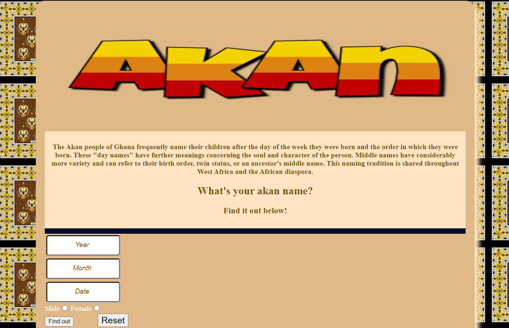

# Akan-Names
Display Akan  Names.

 

A web application that takes a user's birthday and calculates the day of the week they were born and then depending on their gender, outputs their Akan name which are names drived from Ghanaian culture. In ghana children are given their first name as a "day name" which corresponds to the day of the week they were born.

## Author
Eugene Kiprotich.

## Projects Purpose
Most people do know when their birthdays are, but some might not know what day of the week they were born.This will help users to identify their Akan name together with the exact day they were born by just keying in their birth date and their gender.

# Demo
Here is a working live demo: https://eugenek45.github.io/Akan-names/

## Installation instructions
Open a browser, copy and paste the live demo link.It will open the landing page of the app. key in the datails of your birth date Hit the submit button. ....your akan name together with the day of birth will be displayed.

## Mobile support
The Akan-Names app is compatible with devices of all sizes and all OS's and consistent improvements are being made.

## Built With
* HTML - for front end development
 * CSS - styling the user interface. 
 * Javascript - For the business logic. 
 * Bootstrap - for styling of the user interface.

### contact information
eugenekiprotich0@gmail.com

# License and copyright
Eugene, kiprotich Licensed under the [MIT License](LICENSE.md).
